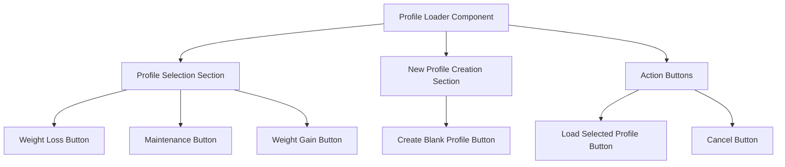

# Profile Loader Component Design

## Overview

The profile loader component will allow users to select one of the three mock profiles (weight loss, maintenance, weight gain) or create a new blank profile from the admin page.

## Analysis Summary

### Mock Data Profiles

The mock data profiles are defined in `src/lib/utils/mockProfileData.ts` and include:

1. **Weight Loss Profile**: 28-year-old male, 180 lbs, 70 inches, moderate activity level, -3500 weekly calorie deficit
2. **Maintenance Profile**: 35-year-old female, 165 lbs, 68 inches, moderate activity level, 0 weekly calorie target
3. **Weight Gain Profile**: 24-year-old male, 155 lbs, 72 inches, moderate activity level, +3500 weekly calorie surplus

Each profile includes:

- Profile data (age, gender, weight, height, activity level)
- Goal data (goal type, weekly calorie target, activity level)
- 30 days of meal data with realistic meal patterns

### Current Admin Page Structure

The admin page (`src/app/admin/page.tsx`) currently has:

- JSON Data Import section
- USDA Food Search section
- Import Instructions section

### Existing API Endpoint

The `/api/debug/reset-profile` endpoint already handles loading mock profiles and accepts a `profileType` parameter (`weight_loss`, `maintenance`, or `weight_gain`).

## Design Plan

### Component Structure



### UI Design

The profile loader will be added as a new card in the admin page grid:

```
┌─────────────────────────────────────┐
│ Profile Loader                      │
├─────────────────────────────────────┤
│ Select a profile to load:           │
│                                     │
│ [ ] Weight Loss Profile              │
│ [ ] Maintenance Profile              │
│ [ ] Weight Gain Profile              │
│                                     │
│ OR                                  │
│                                     │
│ [ ] Create New Blank Profile         │
│                                     │
│ [Load Selected Profile] [Cancel]     │
└─────────────────────────────────────┘
```

### Implementation Details

1. **State Management**:
   - `selectedProfile`: Track which profile is selected (`weight_loss`, `maintenance`, `weight_gain`, or `new_blank`)
   - `isLoading`: Track loading state during profile loading

2. **API Integration**:
   - Use the existing `/api/debug/reset-profile` endpoint for loading mock profiles
   - For new blank profiles, create a new API endpoint or extend the existing one

3. **User Flow**:
   - User selects a profile option
   - User clicks "Load Selected Profile"
   - System loads the selected profile and shows success message
   - User is redirected or data is refreshed automatically

### New API Endpoint (if needed)

If we need to support creating blank profiles, we'll need to extend the API:

```typescript
// POST /api/debug/reset-profile
{
  "profileType": "new_blank"  // or extend existing endpoint
}
```

### Integration with Admin Page

Add the profile loader as a new card in the existing grid layout:

```typescript
<div className="grid grid-cols-1 md:grid-cols-2 gap-8">
  {/* Existing cards */}
  <Card>
    <CardHeader>
      <CardTitle>Profile Loader</CardTitle>
      <CardDescription>Load mock profiles or create new ones</CardDescription>
    </CardHeader>
    <CardContent>
      {/* Profile selection UI */}
    </CardContent>
    <CardFooter>
      {/* Action buttons */}
    </CardFooter>
  </Card>
</div>
```

## Next Steps

1. Create the profile loader component
2. Integrate it into the admin page
3. Test the functionality with all profile types
4. Add error handling and user feedback
5. Document the feature
