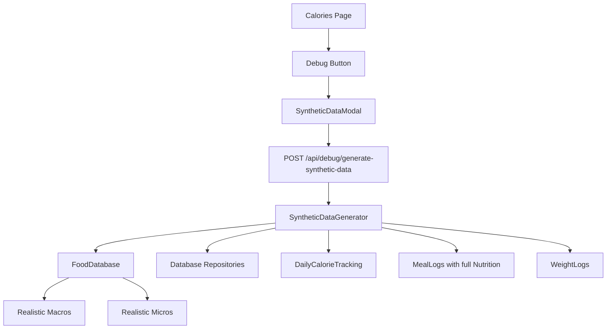

# Synthetic Data Generator for Calorie Counter Testing

## Overview

This plan outlines the development of a realistic synthetic data generator for testing the calorie counter, including a debug button integration on the calories page.

## Current Limitations Analysis

The existing [`mockProfileData.ts`](src/lib/utils/mockProfileData.ts) has several limitations:

1. **Only generates calories** - No realistic macros (protein, carbs, fat, fiber)
2. **Fixed macro ratios** - Uses 50% carbs, 30% protein, 20% fat for all meals (unrealistic)
3. **No micronutrients** - Vitamins and minerals are not generated
4. **Incomplete nutrition object** - Meal data lacks full `NutritionalValues` structure

## Proposed Solution

### 1. Create Realistic Food Nutrition Database

**File**: [`src/lib/utils/syntheticData/foodDatabase.ts`](src/lib/utils/syntheticData/foodDatabase.ts)

Create a comprehensive food database with:

- 50+ realistic food items with accurate macros per 100g
- Realistic micronutrient profiles for each food
- Categories:
  - Proteins (chicken, salmon, beef, tofu, eggs)
  - Grains (rice, oats, bread, pasta)
  - Vegetables (broccoli, spinach, carrots)
  - Fruits (apples, bananas, berries)
  - Dairy (milk, yogurt, cheese)
  - Fats (olive oil, almonds, avocado)
  - Snacks (protein bars, trail mix)

### 2. Implement SyntheticDataGenerator Class

**File**: [`src/lib/utils/syntheticData/generator.ts`](src/lib/utils/syntheticData/generator.ts)

Core methods:

- `generateDailyNutrition(profile: UserProfile, date: string)` - Creates realistic daily nutrition
- `generateMealNutrition(mealType: string, targetCalories: number)` - Realistic macros based on food type
- `generateMicronutrients(foods: Food[])` - Vitamin/mineral values based on consumed foods
- `generateCalorieTracking(profile: UserProfile, goal: CalorieGoal, days: number)` - Daily tracking data
- `generateWeightLogs(profile: UserProfile, trackingData: DailyCalorieTracking[])` - Progressive weight changes

### 3. API Endpoints

**New**: `POST /api/debug/generate-synthetic-data`

- Body: `{ profileType: 'weight_loss' | 'maintenance' | 'weight_gain', days?: number }`
- Generates 30 days of realistic meal logs and calorie tracking

**New**: `POST /api/debug/generate-profile`

- Body: `{ profileType: 'weight_loss' | 'maintenance' | 'weight_gain' }`
- Generates synthetic profile with full nutrition targets

### 4. Debug Button Component

**File**: [`src/components/debug/SyntheticDataModal.tsx`](src/components/debug/SyntheticDataModal.tsx)

Features:

- Modal dialog for selecting scenario
- Progress indicator during generation
- Results summary after completion
- Only visible in development mode

### 5. Integrate Debug Button into CaloriesPage

**File**: [`src/app/calories/page.tsx`](src/app/calories/page.tsx)

Add debug button in header section (near the existing "Log Meals" button):

- Small icon button (gear or database icon)
- Opens SyntheticDataModal
- Conditionally rendered based on `process.env.NODE_ENV`

## Data Flow

## Example Generated Data

| Meal                       | Calories | Protein | Carbs | Fat | Fiber | Key Micros                 |
| -------------------------- | -------- | ------- | ----- | --- | ----- | -------------------------- |
| Oatmeal with berries       | 320      | 12g     | 54g   | 6g  | 8g    | Iron, Vit C, B6            |
| Grilled chicken salad      | 420      | 38g     | 12g   | 22g | 4g    | Vit K, Iron, B12           |
| Baked salmon with broccoli | 550      | 42g     | 8g    | 38g | 5g    | Vit D, Omega-3, B12, Vit K |
| Apple with almond butter   | 280      | 6g      | 32g   | 16g | 6g    | Vitamin E, Potassium       |

## Implementation Steps

1. Create `src/lib/utils/syntheticData/` directory
2. Create `foodDatabase.ts` with comprehensive food nutrition data
3. Create `generator.ts` with SyntheticDataGenerator class
4. Create API endpoint `src/app/api/debug/generate-synthetic-data/route.ts`
5. Create `SyntheticDataModal.tsx` component
6. Update `CaloriesPage.tsx` to include debug button
7. Test the complete solution

## Files to Create/Modify

### New Files

- `src/lib/utils/syntheticData/foodDatabase.ts`
- `src/lib/utils/syntheticData/generator.ts`
- `src/lib/utils/syntheticData/index.ts`
- `src/components/debug/SyntheticDataModal.tsx`
- `src/app/api/debug/generate-synthetic-data/route.ts`

### Modified Files

- `src/app/calories/page.tsx` - Add debug button
